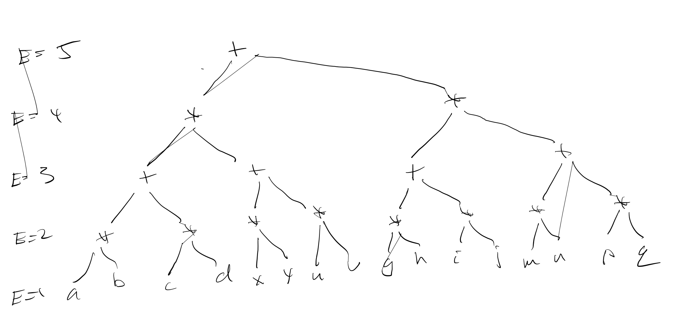

# Dynamic Programming
When attempting to compile an arithmetic expression to assembly language with a limited number of registers
there are a large number of possible results and it is not immediately clear what an optimal strategy should be.

Dynamic programming provides an approach which is not that computationally expensive (linear in the size of the expression)
and which provides the best possible results for a simple model of a CPU.

The idea is to assume you have up to "r" registers and to calculate for each node of the parse tree for the expression
the minimal cost of evaluating that expression with $i$ registers for $i=0,\ldots,r$.  In the case of 0 registers, we
calculate the minimal cost of evaluating it with all "r" registers and then storing the result into memory.

For this to work we must have a complete list of the assembly language operations and their costs. For today, we consider
the following operations, where Ri are registers or constants (as the first argument) and Mi are memory locations

| instruction | cost | meaning | formula | 
|   ---    | --- |         ---                                                |  ---           |
| ST Ri Mj | 10  | store the value of Ri in memory location Mj                | Mj <- Ri       |
| LD Mj Ri | 10  | load the value at memory location Mj into register Ri      | Ri <- Mj       |
| LD Rj Ri |  1  | copy the value of Ri into Rj                               | Ri <- Rj       |
| OP Rj Ri |  5  | apply the binary operation OP to Ri and Rj and store in Rj | Ri <- Ri OP Rj |

We also assume that all of the variables at the leaves of the tree are distinct, which we will get if we convert the
tree into a DAG.

The general strategy will be to select subtrees which we will evaluate first with all of the registers
and store the result in memory, and then we'll be left with a tree that we want to evaluate with r registers
and no stores. 

What are the expressions (i.e. parse trees) that can be evaluated with r registers and no stores??
* For r = 0,1 there are no such expressions as we assume the leaves are distinct and instructions take 2 registers.
* For r=2, some examples are (a+b) or (a*(b-c)) ...
* What are some examples for r=3,4, ...

So the Dynamic Programming model calculates several costs for each node E = A op B.
* for any node in the parse tree we can decide to evaluate it first with all registers and store the result in memory
* if we evaluated enough of the subtrees and stored their values in memory, then we can evaluate the remaining expression
  with r registers and no stores.

We can implement a heuristic model using this approach and Ershov numbers:
* find the Ershov numbers of all nodes in the tree, then evaluate the leftmost one which can be evaluated with "r" registers into memory and repeat

Try this with $(a*b+c*d)*(x*y+u*v) + (g*h+i*j)*(m*n+p*q)$
* draw the tree
* find the Ershov numbers
* find an evaluation with 3 registers

This won't necessarily be optimal though because you would like to minimize the Loads and Stores, but we can use dynamic programming to get a provably optimal evaluation, with our assumptions about execution time for the basic instructions.

Calculate $c_0(E)$ by 
1. evaluating A with r registers and B with r-1 then do one operation and store the result in memory
   $c_r(A) + c_{r-1}(B) + c(Op) + c(ST)$
2. or the same with A and B switched

This gives the optimal time to evaluate E using all registers, and store the result in memory.

Calculate $c_s(E)$ for $2\le s \le r$ as follows:
1. Evaluate A ahead of time at cost $c_0(A)$, the evaluate B with s registers, load A into a register and do the operation
   $c_0(A) + c_s(B) + c(LD) + c(Op)$
2. Do the same with B computed ahead of time:
   $c_0(B) + c_s(A) + c(LD) + c(Op)$
4. Evaluate A with s register (storing the result in one of them), then B with s-1 registers, then do one operation
   $c_s(A) + c_{s-1}(B) + c(Op)$
5. Do the same with A and B switched:
   $c_s(B) + c_{s-1}(A) + 1$
   
We then take the minimum of 1-5 and store that in $c_s(E)$ (along with the code $L_s(E)$ to achieve that minumum.

In practice, this algorithm will result in code that first evaluates subtrees of the original expression, storing them
in memory locations, and then evaluates the resulting expression using r registers and no stores!

You might want to try to write the code to generate this optimal evaluation!

