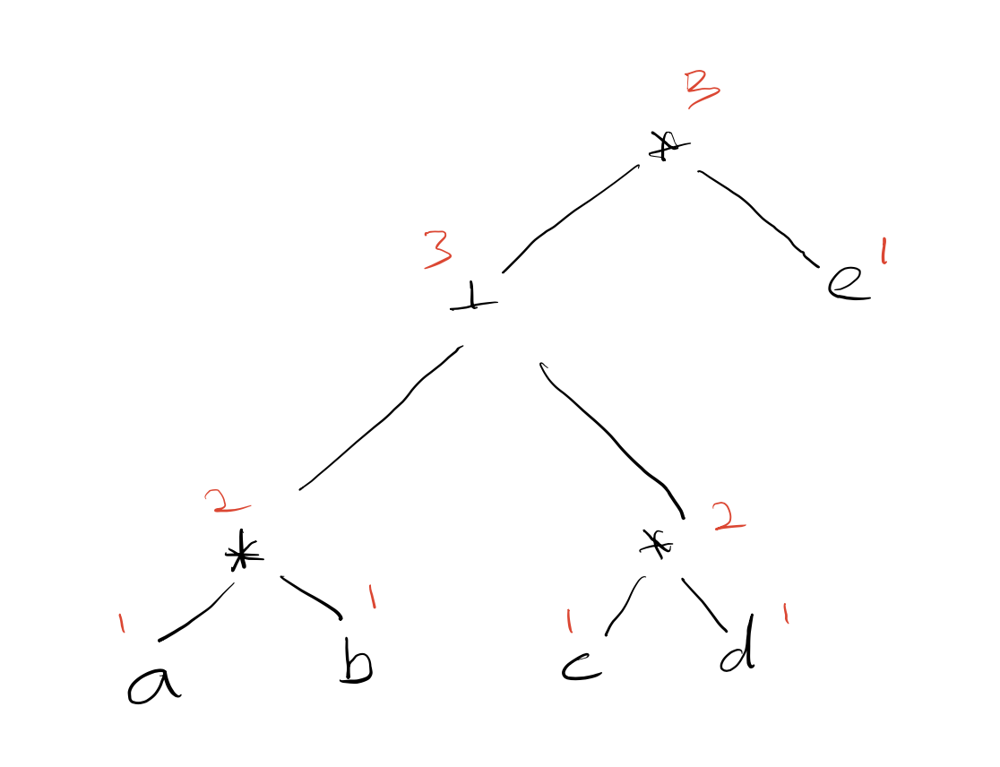

# Ershov numbers
If we have an infinite supply of registers, then we can fairly easily write code to evaluate an arithmetic expression
using the minimal number of registers. We calculate this number for the parse tree of the expression.
This number is called the Ershov number of the parse tree. The rules are simple. We assume that we have
already used $b$ registers
* for a leaf the erhov number is 1 and we compile it into ```LOAD VAR Ri``` where Ri is register $b+1$
* for a node ```E1 op E2``` where E1 and E2 have the same Ershov number N,
  * we use registers, $b+2,..., b+N+1$ to evaluate E1, and put the result in Register R(b+N+1)
  * then we use registers $b+1,...,b+N$ to evaluate R2 and put the result in Register R(b+N)
  * then we generate the instruction ```OP R(b+N) R(b+N+1)```
* for a node ```E1 op E2``` where they have different Ershov numbers, let N be the biggest of the two ershov numbers,
  then the ershov number will be N and we generate code by
  * first evaluating the bigger subexpression and putting the result in R(b+N)
  * the evaluating the smaller subexpression and putting the result in R(b+M) where M<N
  * generate the code ```OP R(b+N) R(b+M)``` or ```OP R(b+M) R(b+N)``` depending on whether the 1st or 2nd subexpression is the larger one

For example, 
```
((a*b)+(c*d))*e
```
would have Ershov number 3 



and would compile to
```
LOAD b R2
LOAD a R3
MUL R2 R3
LOAD d R2
LOAD c R1
MUL R1 R2
ADD R2 R3
LOAD e R1
MUL R1 R3
```

## Practice
Find the Ershov number of the following expression and generate optimal code to evaluate it using that number of registers.
```
x +y*(z+(w+u)*(r+s))
```


  
