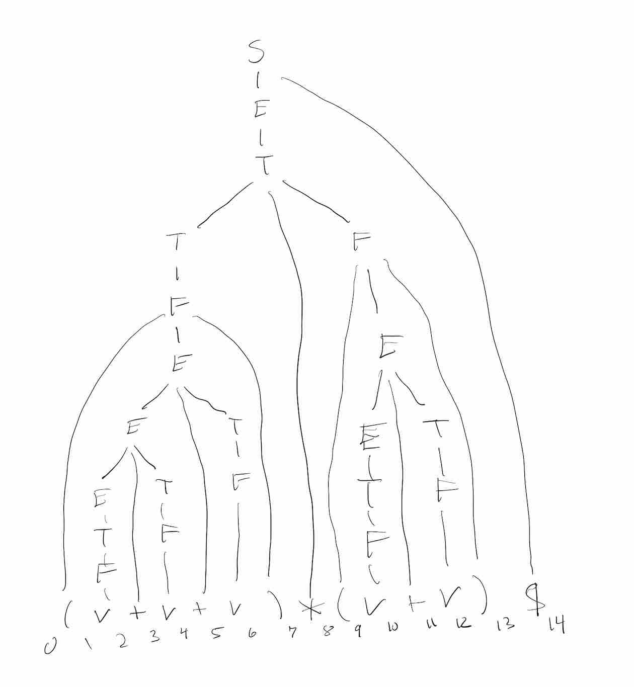

# Intro to LR Parsing
LR parsing is a shift-reduce parser which generates the parsing tree from the bottom to the top
as opposed to LL parsing which generates the parse tree from the top to the bottom.

## LR(0) items
The key concept underlying LR parsing is the notion of an LR-item which consists of a grammar rule
with a "dot" added to the right hand side

$$A \rightarrow \alpha . \beta$$

It corresponds to a derivation with root A where the symbols in $\alpha$ have been expanded to terminals.
Either or both of $\alpha$ and $\beta$ can be empty (i.e. $\epsilon$)

Consider the following left-recursive unambiguous grammar for arithmetic expressions
```
S -> E $
E -> E + T
E -> T
T -> T * F
T -> F
F -> v
F -> (E)
```
Below is a parse tree for the string "(v+v+v)*(v+v)$"


